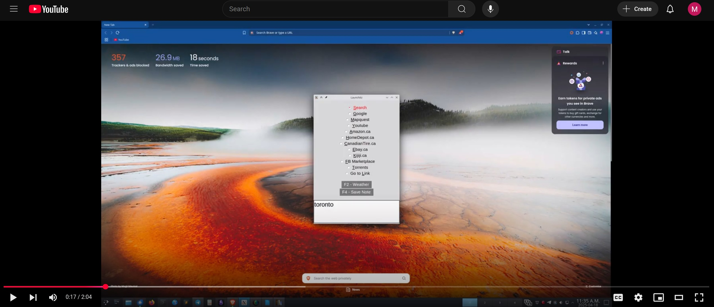
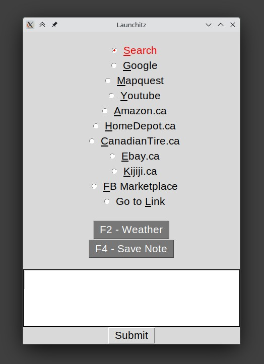

# Search_Launcher
This is a  tool I created in Python and use every day.
It is my quick search box I use to quickly get search results from sites I often use.  

I trigger it to open using the '~' key (autoqt script).  Type in what I want to search, use the shortcut key to select the site I want to use, and press enter.  With just a few keystrokes the website opens with the search results I am looking for.  No longer do I need to open a browser, navigate to the website, navigate to the search box, and enter my search term.

<A HREF="https://www.youtube.com/watch?v=WzH3QNOlijc">Youtube Demonstration Video</A>

